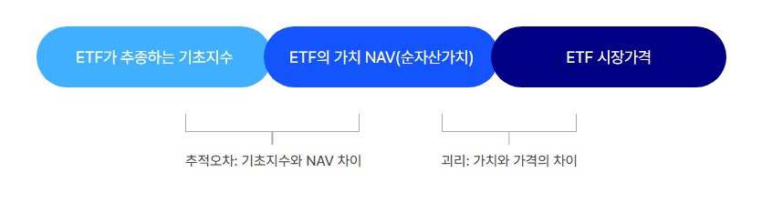
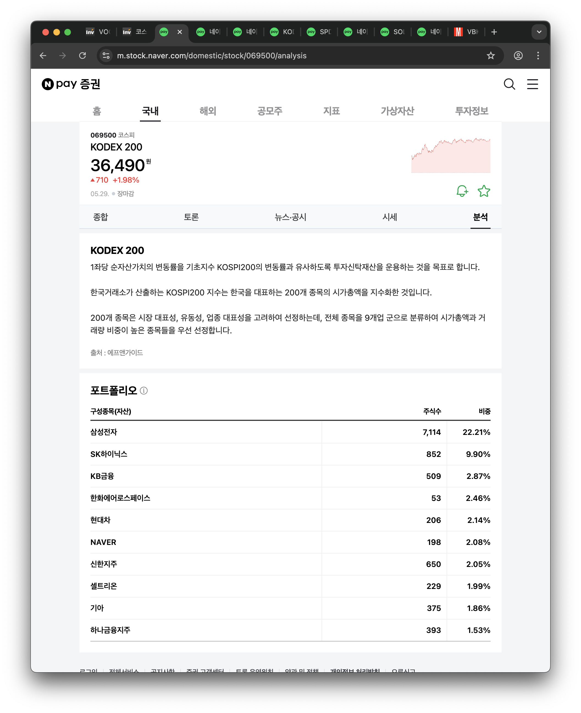
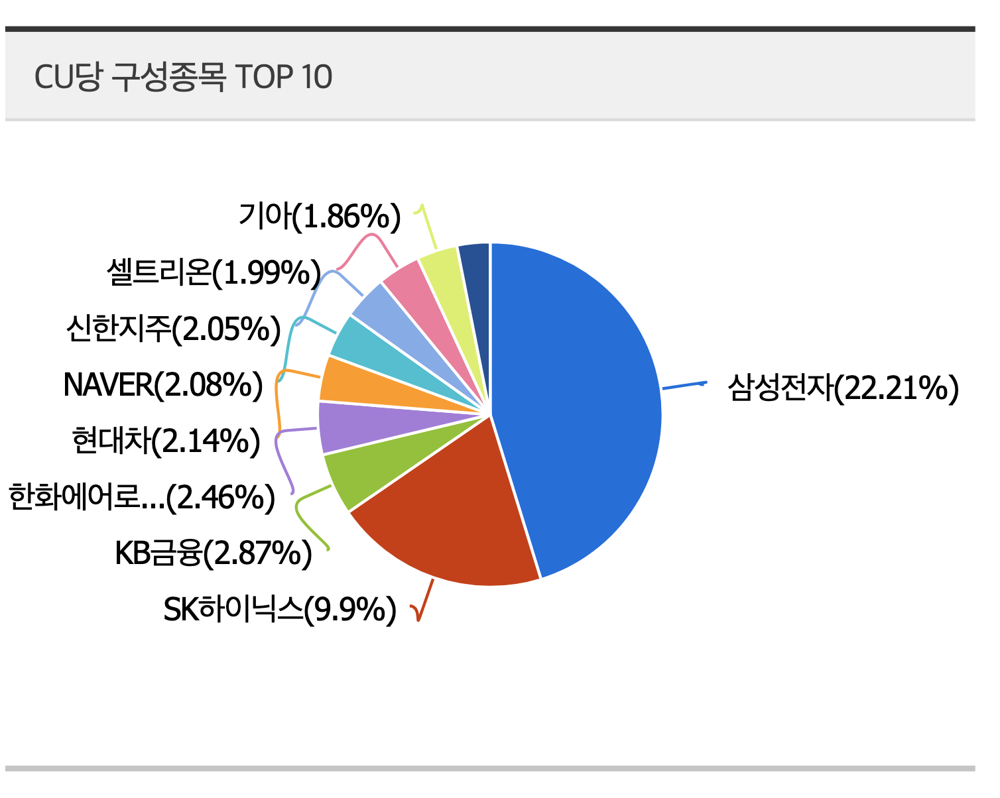
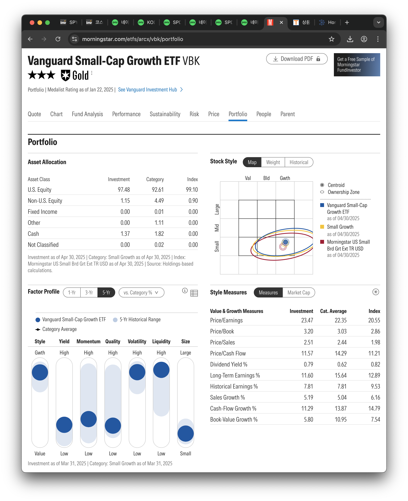
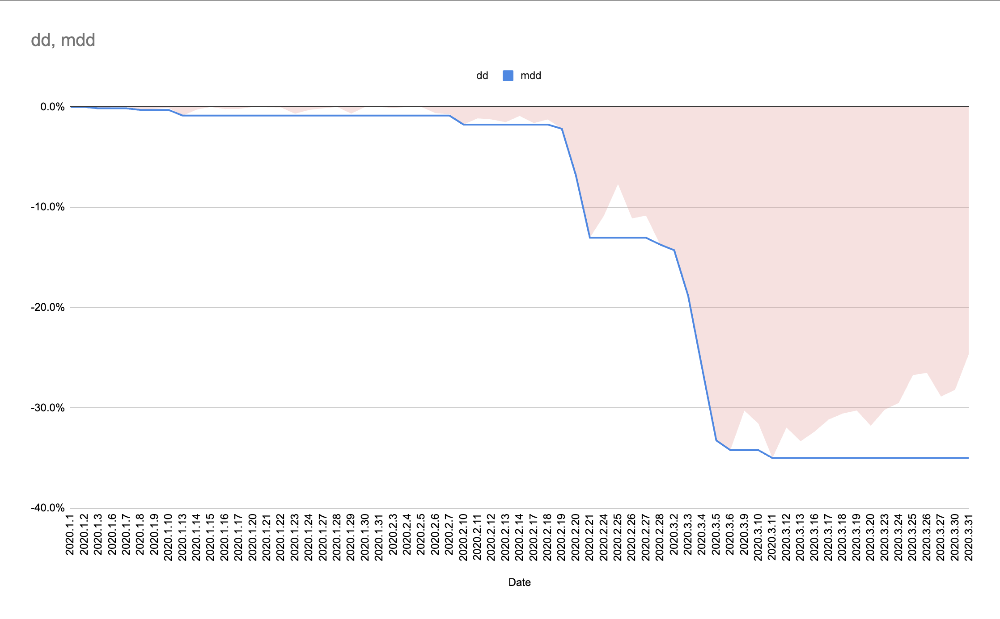
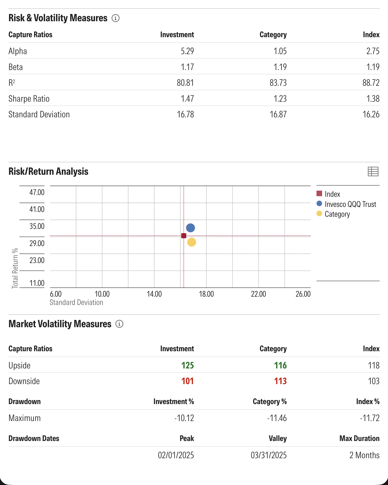

# etf-basic

## 3. ETF 기본 개념과 투자 매력

안녕하세요. 이번 코스에서 ETF 관련 이론을 설명해 드릴 재무금융 박사 김정란입니다.

첫번째 시간에는 ETF의 개념에 대해서 말씀을 드리려고 하는데요,

ETF는 Exchange Traded Fund의 약자로 말 그대로 거래소에 상장되어 주식처럼 거래되는 펀드를 얘기합니다.

그러면, 펀드란 무엇일까요?

펀드는 여러 사람들의 돈을 모아 전문가가 관리하는 투자 방식입니다.

즉, 다수의 투자자로부터 자금을 모아서 전문적인 운용사가 주식, 채권, 부동산 등 다양한 자산에 분산 투자해주는 금융상품을 의미 합니다.

예를 들어서 만약에 코스피200 주가지수대로 수익이 발생하는 구조를 가지고 싶다면, 200가지 종목을 다 매수해야 하잖아요,

200가지 종목을 다 매수하려면 투자금도 많이 들고 여간 번거로운 게 아니겠지요?

이때, 여러 사람들의 자금을 모아서 코스피 200 종목으로 운용을 해주는 것을 바로 펀드라고 합니다.

즉, ETF도 펀드인데요, 기존 펀드는 주식시장에서 사고 팔고가 안됐지만,

이러한 펀드를 주식시장에서 사고 팔 수 있는 것이 ETF입니다. 이 점이 바로 기존 펀드와는 다른 점입니다.

펀드의 장점과 주식의 장점을 결합한 투자 상품이라고 이해하시면 됩니다.

ETF 시장은 전 세계적으로 폭발적인 성장을 이어가고 있는데요, 다음의 여러가지 장점이 있기 때문이에요.

첫번째 장점은 ETF가 비용이 저렴하다는 것입니다.

펀드는 운용사에서 돈을 모아서 운용을 해주다 보니, 비용을 받는데요.

보통의 주가지수 대로 움직이는 인덱스 ETF의 비용은 평균으로 연간 약 0.204%에요, 기존 펀드 대비 비용이 저렴합니다.

여기서 잠깐, 인덱스 ETF란 코스피 200이나 S&P500처럼 시장 평균 수익률을 따라가는 ETF를 뜻합니다.

그렇지만 시장 평균 수익률을 넘는 것을 목표로 적극적으로 운용하는 ETF도 있는데요, 이러한 ETF를 액티브ETF라고 합니다.

액티브ETF는 조금 더 높은 수익을 추구하다보니 인덱스 ETF 대비 비용이 조금 더 높겠지요? 그래도 액티브 ETF 또한 기존 펀드보다 비용이 저렴합니다.

장기 투자를 할 때는 이러한 비용의 차이가 수익률에 큰 영향을 주는데요.

예를 들어 연간 보수가 0.2%인 ETF는 10년간 비용이 2%인데 반하여, 연간 보수가 2%인 액티브 ETF가 있다면, 10년간 비용은 20%나 되기 때문입니다. 그래서 비용이 저렴한 ETF의 인기가 좋습니다.

두번째 장점은 높은 유동성과 거래 편의성입니다.

ETF는 증권거래소에 상장되어 있기 때문에 주식처럼 실시간으로 사고 팔수가 있습니다.

원하는 가격에 즉시 사고 팔수 있을 만큼 유동성이 뛰어나죠.

반면 기존 펀드는 환매 신청 후 돈을 받기까지 며칠이 걸립니다.

즉, 시장가에 매도를 할 수 없고 하루나 이틀 후에 기준가로 체결이 되다보니 내가 확인한 수익률이 변동되는 것이 다반사입니다.

특히 주식형은 그 변동성이 더 심하겠지요. 그래서 즉시 사고 팔수 있는 ETF의 유동성은 큰 장점으로 작용하고 있습니다.

세번째 장점은 분산 투자 효과 입니다.

분산 투자를 하게 되면 개별 기업의 리스크를 줄일 수 있는데요, ETF는 한 종목만으로도 수십, 수백 개의 자산에 분산 투자하는 효과를 누릴 수 있습니다.

예를 들어, 코스피200 지수를 추종하는 ETF 1주를 매수하면 코스피200에서 구성하는 종목 200개에 모두 투자하는 셈입니다.

만약 직접 200개 종목을 각각 매수하려면 1천만원이 넘는 돈이 필요하지만 ETF는 약 3만원으로 동일한 효과를 낼 수 있는거죠.

ETF의 네번째 장점은 자동으로 리밸런싱을 해준다는 것 인데요,

투자를 할 때는 정기적으로 포트폴리오 점검을 해주는 것이 필요한데, 이를 리밸런싱이라고 합니다.

지수 구성이나 비중이 바뀌면 ETF도 따라서 비중이 조정되거든요, 그래서 투자자는 별도로 종목을 교체할 필요 없습니다.

ETF를 보유한 것만으로 지수를 쫓아가는 전략을 유지할 수 있는거죠. 이는 투자자의 관리 부담을 덜어주는 효과를 가져옵니다.

이러한 장점들로 인해서 ETF 시장 규모는 갈수록 커져가고 있습니다.

기관과 개인 할 것 없이 비용 절감, 유동성, 그리고 분산투자의 장점을 찾아서 ETF로 몰려들고 있는 것이죠.

이번 시간에는 ETF의 정의와 투자 매력, 그리고 성장 추세와 관련하여 알아보았습니다. 다음 시간에는 ETF의 종류와 특성에 대하여 알아보는 시간을 갖겠습니다.

감사합니다.

## 4. ETF 종류와 특성 이해하기

안녕하세요,

오늘은 ETF의 다양한 종류와 그 특성에 대하여 이해하는 시간을 갖겠습니다.

ETF는 추종하는 전략과 자산의 범위에 따라 여러 종류로 나뉘는데요,

대표적으로는 인덱스 ETF와 액티브 ETF로 나눌 수 있고, 또 투자 지역에 따라 국내 ETF, 해외 ETF로 나눌 수 있습니다. 그리고 특정한 섹터에나 테마에 투자하는 섹터/테마 ETF로도 나눌 수 있죠.

먼저 인덱스 ETF와 액티브 ETF의 차이를 알아볼까요?

인덱스 ETF는 이름 그대로 특정 지수에 연동되도록 구성한 ETF 입니다.

시장 수익률을 그대로 추종하는 것을 목표로 하는 ETF인데요, 93%에 달하는 대부분의 ETF가 이러한 인덱스ETF 입니다. 이를 패시브 전략으로 운용한다라고도 표현합니다.

반면, 액티브ETF는 운용 매니저나 알고리즘이 지수를 초과하는 성과를 얻기 위해서 적극적으로 종목을 선택하고, 비중도 조절해서 운용해 주는 ETF 입니다.

과거에는 ETF 시장이 거의 인덱스 중심이이었는데요, 최근에는 액티브 ETF가 많이 늘어나고 있습니다.

이는 기준 지수에 더해서 초과 수익을 추구하는 것에 대하여 투자자들의 관심이 늘고 있다는 뜻 입니다.

ETF를 선택하실 때 시장 평균 수익을 추종하시길 원한다면 인덱스 ETF를 선택하시면 되고요,

조금 더 적극적으로 운용해서 달성할 수 있는 초과수익을 노린다면 액티브 ETF를 선택하면 됩니다.

두번째로 구분할 수 있는 것이 투자 지역별로 나누는, 국내 ETF와 해외 ETF 인데요.

국내 ETF는 코스피나, 코스닥 등 우리나라에 투자하는 ETF이고, 해외 ETF는 미국, 중국, 선진국, 신흥국 등 각국의 시장 지수나 자산에 투자하는 ETF를 의미합니다.

예를 들어서 미국의 S&P500 지수를 추종하는 ETF도 있고요. 홍콩H지수를 추종하는 ETF등도 있습니다.

투자자는 국가 별로 경제 전망이나 환율 변동 등을 고려해서 국내외 ETF 비중을 조절해서 투자하면 됩니다.

마지막으로 구분되는 섹터 및 테마형 ETF에 대하여 말씀드리겠습니다.

섹터 ETF는 IT, 금융, 헬스케어, 에너지 등 특정 산업 부문의 대표 지수를 추종하는 ETF를 말하는데요.

그런데 최근에는 테마형 ETF가 많이 출시되고 있습니다. 테마형 ETF는 투자자들의 관심을 끌 수 있는 보다 구체적인 스토리나 트렌드를 중심으로 한 ETF를 말합니다.

예를 들어서 ‘AI 빅테크 7’, ‘전기차 배터리’와 같은 ETF들이 있다면,이러한 예시가 테마형 ETF입니다.

투자자들은 섹터/테마 ETF를 통해서 관심 있는 특정 산업이나 테마에 선택적으로 투자할 수 있습니다.

섹터 ETF의 경우에는 경기 상승기에는 큰 수익을 낼 수도 있지만, 경기 침체기에는 반대로 빠르게 하락할 위험도 있습니다.

이러한 섹터/테마형 ETF는 경기에도 민감하고 변동성도 다소 크기 때문에 선택을 하실 때는 위험을 관리하는 것이 중요하다고 말씀드리고 싶습니다. 즉, 분산투자가 필요하다는 것이죠.

이처럼 ETF는 형태에 따라서 각기 다른 특성을 가지고 있기 때문에,

본인의 투자 목적과 성향에 맞는 ETF를 고르는 것은 매우 중요합니다.

예를 들어, 안정적으로 시장 전체에 투자하고 싶다면 인덱스 ETF를 선택하시고,

특정 분야의 고성장에 베팅하고 싶다면 관련 섹터 ETF를 선택하는 식 입니다.

다음 강의에서는 이러한 ETF를 평가할 때 어떤 지표들을 봐야하는지 알아보겠습니다.

감사합니다.

## 5. ETF 평가의 핵심 지표 (1) - 기본 정보

안녕하세요, 재무금융 박사 김정란입니다.

투자하고자 하는 ETF를 고를 때, 무엇을 가장 먼저 확인해야 할까요?

이번 강의에서는 ETF를 고를 때 꼭 알아야 하는 핵심 지표들을 살펴보도록 하겠습니다.

구체적으로 운용 보수, 총 보수, 거래량과 유동성, 추적 오차 그리고 설정일과 운용 규모에 대해서 말씀드리겠습니다.

먼저 운용 보수부터 말씀드릴게요.

운용 보수는 ETF를 운영하는 데 드는 연간 비용을 이야기합니다.

투자 금액에 대한 비율로 표시되는데요, 예를 들어서 운용 보수가 0.2%인 ETF에 100만 원을 투자하면 운용 비용은 연간 2천 원인겁니다.

운용 보수는 낮을수록 투자자에게 유리하겠지요. 같은 지수를 추종하는 ETF를 비교한다면 운용 보수가 낮을수록 수익률 면에서 유리합니다.

연간 보수가 0.07%인 ETF와 0.5%인 ETF는 10년 후에 4.3% , 20년 후에 8.6%의 수익률 차이를 가져올 수 있습니다.

운용 보수 외에 총 보수의 개념도 있는데요,

총 보수에는 운용 보수를 포함하여 기타 부대 비용이 모두 포함된 보수입니다. ETF의 자산을 보관 관리하는 비용인 신탁 보수, 사무를 관리해주는 회사에 지불하는 사무수탁 수수료 등이 기타 부대 비용에 포함됩니다.

예를 들어, 인덱스 ETF인 KODEX200 ETF의 경우 운용 보수는 연 0.15%인데, 운용 보수를 포함하여 총 보수는 연 0.1615%입니다.

그래서 ETF의 비용을 볼때는 총 보수로 보는 것이 좋습니다. 다행히도 운용사간 ETF 경쟁이 치열하여 보수가 지속적으로 낮아지고 있습니다.

ETF를 고를 때는 거래량과 유동성도 체크하는 것이 좋은데요,

일일 거래량이 많고 유동성이 풍부한 ETF일수록 매매하기 유리합니다.

왜냐하면 거래가 활발하지 않은 ETF는 사고 팔 때 매수, 매도 호가의 차이가 벌어져

낮은 가격에 체결될 수 있기 때문입니다.

저도 거래량이 작은 ETF를 매수한 적이 있었는데, 몇 번의 호가를 낮춰서 매도했던 경험이 있습니다. 그래서 ETF의 평균 거래량을 살펴보고 거래가 너무 부진한 ETF는 피하는 것이 좋습니다.

다음으로 체크하면 좋은 지표는 추적 오차입니다.

추적 오차는 ETF의 수익률이 추종하는 지수와 얼마나 차이가 나는지를 나타내는 지표 인데요,

만약에 추적 오차가 0에 가깝다면 기초지수가 10% 오를 때 ETF도 거의 10% 오르기 때문에 가장 이상적인 상황입니다.

하지만 현실에서는 운용 보수, 종목 교체 시 발생하는 거래 비용, 재투자 지연 등으로 약간의 오차가 발생합니다.

운용사의 운용 능력에 따라 추적 오차의 크기가 달라지므로 같은 지수를 추종한다면 추적 오차가 더 적은 ETF를 선택하는 것이 유리합니다.

일반적으로 추적오차가 연간 기준 1% 미만이면 양호한 편으로 봅니다.

즉, 추적오차는 NAV ‘일별’ 수익률에서 벤치마크 ‘일별’ 수익률을 빼준 값의 표준편차 인데요.

다시 정리하면, ETF가 벤치마크 대상을 얼마나 안정적으로 따라가고 있는지는 확인 할 수 있는 지표입니다.

제가 지금 NAV라는 용어를 말씀드렸데요, NAV란 ETF 1주당 순 자산가치를 이야기합니다.

ETF가 보유한 자산의 총가치에서 부채 등을 제외한 다음에 전체 발행주식 수로 나눈 값인거죠.

이 NAV는 이론가격인데요. 실제 ETF는 이론 가격하고 차이가 나는 경우가 있습니다. 이 때 등장하는 개념이 괴리율입니다. ETF의 실제 가격과 ETF의 NAV, 즉 이론가격과의 차이를 괴리율이라고 합니다.

추가로 상대수익률 지표도 알고 계시면 좋은데요, 이 지표는 ETF가 벤치마크 지표를 장기적으로 얼마나 정확히 추종했는지를 측정하는 지표입니다.

일정기간 NAV 수익률에서 벤치마크 수익률을 뺀 값으로 계산을 해줍니다.

추적오차는 일별 수익률의 차이의 표준편차라면, 상대수익률은 일정기간 누적수익률의 차이라는 것이 서로 다른 점 입니다.

---

다음으로 체크하면 좋은 지표는 추적 오차입니다.

추적 오차는 ETF의 수익률이 추종하는 지수와 얼마나 차이가 나는지를 나타내는 지표 인데요,

만약에 추적 오차가 0에 가깝다면 기초지수가 10% 오를 때 ETF도 거의 10% 오르기 때문에 가장 이상적인 상황입니다.

하지만 현실에서는 운용 보수, 종목 교체 시 발생하는 거래 비용, 재투자 지연 등으로 약간의 오차가 발생합니다.

운용사의 운용 능력에 따라 추적 오차의 크기가 달라지므로 같은 지수를 추종한다면 추적 오차가 더 적은 ETF를 선택하는 것이 유리합니다.

일반적으로 추적오차가 연간 기준 1% 미만이면 양호한 편으로 봅니다.

추가로 NAV라는 용어를 알고 계시면 좋은데요,

NAV란 ETF 1주당 순 자산가치를 이야기합니다.

ETF가 보유한 자산의 총가치에서 부채 등을 제외한 다음에 전체 발행주식 수로 나눈 값인거죠.

이 NAV는 이론가격인데요. 실제 ETF는 이론 가격하고 차이가 나는 경우가 있습니다.

이 때 등장하는 개념이 괴리율입니다.

ETF의 실제 가격과 ETF의 NAV, 즉 이론가격과의 차이를 괴리율이라고 합니다.

---

마지막으로 소개해드릴 지표는 설정일과 운용 규모 입니다.

설정일은 해당 ETF가 처음태어난 날로 ETF가 얼마나 오랜 기간동안 운용되고 있는지를 알 수 있는 지표 입니다.

일반적으로 설정한지 오래된 ETF 일수록 운용 경험이 쌓여있고,

추적 오차 관리 등이 안정적일 가능성이 높습니다.

반면, 출시 된지 얼마 안 된 ETF는 데이터가 적어서 신중한 관찰이 필요합니다.

운용 규모는 해당 ETF에 얼마나 많은 자금이 들어와 있는지를 나타내는 지표인데요, 규모가 너무 작은 ETF는 유동성 부족이나 상장 폐지 위험이 있을 수 있습니다.

보통 수백억 원 미만의 초소형 ETF는 운용사가 수익성이 안 맞아 청산할 가능성이 있이 때문에 유의해야 합니다.

규모가 크면 규모의 경제로 운용 효율이 높아지고 기관 투자자들도 참여하여 안정성이 높아지는 경향이 있습니다.

이번 시간에는 ETF를 평가할 때 필요한 핵심 지표에 대하여 알아보았습니다. 다음 강의에서는 ETF의 포트폴리오 구성 내역을 분석하는 방법을 알아보도록 하겠습니다.

감사합니다.

## 6. ETF 평가의 핵심 지표 (2) - 포트폴리오 구성

안녕하세요,

ETF를 이해하려면, 해당 ETF가 어디에 투자하고 있는지를 살펴봐야 하는데요.

이번 강의에서는 ETF가 담고있는 종목과 자산 비율 등을 포트폴리오 관점에서 평가하는 지표를 알아보는 시간을 가져보겠습니다.

포트폴리오 관점에서 중요한 지표는 상위 보유 종목과 비중, 섹터별/국가별/시가총액별 분포, 가치주/성장주 비율, 그리고 포트폴리오 회전율입니다.

먼저 상위 보유 종목 Top 10과 집중도입니다.

대부분의 ETF 운용보고서나 상세 정보를 보면 해당 ETF가 가장 많이 보유한 상위 10개 종목과 비중이 공개되어있습니다.

이를 통해서 핵심적으로 담고 있는 종목을 확인할 수 있는데요.

예를 들어 ETF 상위 종목이 삼성전자, SK하이닉스 등으로 상위 10개에 50%이상 집중되어 있다면,

사실상 해당 ETF는 삼성전자 등 몇몇 종목의 움직임에 크게 영향을 받는다는 뜻 입니다.

반면 상위 10개 종목의 비중 합이 20~30%에 불과하다면, 포트폴리오가 분산 되어있다는 의미겠지요.

한 두 회사에 투자해서 주가가 상승한다면, 좋겠지만 예상과 다르게 하락할 경우 한 주식이나 섹터에 집중되어 있다면 손실이 커질 수 있습니다. 그래서 계란을 한 바구니에 담지 말라는 유명한 말도 있지요.

투자하기 전에는 상위 구성 종목 및 비중을 꼭 확인하는 것이 필요합니다. 집중도를 보고 분산 투자를 할지, 아니면 집중 투자를 할지 본인의 투자 목적에 맞게 ETF를 선택하면 됩니다.

또한, 섹터 및 국가별 자산 분포도 중요한 지표 인데요,

만약 어떤 ETF가 특정 섹터에 40~50%정도 몰려 있다면 해당 섹터가 부진할 때 ETF 전체에 큰 타격이 올 수 있음을 인지해야 됩니다.

특정 섹터에 몰려 있을 수록 잘되면 고수익을 볼 수 있지만, 예상과 반대로 가는 경우 손실을 볼 수 있기 때문에 섹터 ETF는 위험 감수 성향이 높은 투자자에게 적합합니다.

국가별 분포도 또한 마찬가지 입니다.

이머징 마켓 ETF라면 중국, 대만, 인도 등의 이머징 국가의 비중을 살펴보고, 만약 한 나라의 비중이 과도하면 그 나라의 정치/환율 리스크가 ETF의 수익률에 영향을 줄 수 있음을 인지해야 합니다.

아무래도 이머징 국가들의 변동성이 커서 기대수익도 큰 만큼 리스크도 크겠지요. 역시 이머징 마켓 투자도 위험 감수성향이 높은 투자자에게 적합합니다.

시가총액별 분포도 유용한 지표인데요, 대형주 위주인지 중소형주까지 포함하는지에 따라서 변동성과 성장잠재력이 다르기 때문입니다.

대형주보다는 중소형주가 변동성이 크고 기대수익도 높습니다. 그래서 중소형주는 역시 위험 감수성향이 높은 투자자에게 적합합니다.

스타일 관점에서는 가치주 vs 성장주의 비중도 알아둘 만 한데요,

일부 ETF는 투자하고 있는 포트폴리오가 저PER 가치주 위주인지 고성장주 위주인지를 알려줍니다.

현재 시장 국면이 가치주 선호장인지 아니면, 성장주 선호장인지에 따라서 ETF의 투자 결과는 달라질 수 있겠지요.

안정성향인 경우는 변동성이 낮은 가치주가 적합하고, 위험 감수 성향이 높은 투자자는 변동성이 다소 높은 성장주가 적합합니다.

마지막으로 포트폴리오 회전율 지표도 눈여겨 볼 만한 지표입니다.

회전율은 펀드가 보유 자산을 얼마나 자주 교체하는지를 나타내는 비율입니다,

예를 들어서 회전율이 20%라면 1년에 포트폴리오의 5분의 1 정도가 바뀐다는 뜻입니다.

인덱스 ETF의 경우 지수 편입 종목이 가끔 바뀌는 정도라서 보통 회전율이 낮은 반면,

액티브 ETF나 특정 테마 ETF는 시장 상황에 따라 종목을 적극적으로 교체하기 때문에 회전율이 높을 수 있습니다.

높은 회전율은요, 거래 비용 증가로 이어질 수 있기 때문에 특별한 이유 없이 회전율이 높다면 효율성이 떨어지는 ETF일 수 있습니다.

물론 일부 액티브 ETF는 높은 회전율에도 불구하고 초과수익을 창출하기도 합니다.

하지만, 일반적으로는 낮은 회전율은 저비용으로 해석됩니다.

정리하면, ETF 투자 전에 이 ETF 안에는 무엇이 얼마나 들어있는지?를 점검하고 투자를 결정해야 합니다.

이러한 포트폴리오 지표를 통하면, ETF 이름에 드러난 지수명 뿐 아니라

내부 구성의 차이를 파악하여 경제 상황과 투자자의 성향에 맞는 투자 의사 결정을 내릴 수 있기 때문입니다.

이번 시간에는 ETF 포트폴리오를 평가하는 지표에 대하여 알아보았습니다.

다음 시간에는 ETF의 성과 및 위험과 관련된 지표를 알아보겠습니다.

감사합니다.

## 7. ETF 평가의 핵심 지표 (3) - 성과 및 위험

안녕하세요, 재무금융 박사 김정란입니다.

ETF를 평가할 때는 성과와 위험 지표도 꼼꼼하게 살펴봐야 하는데요,

이번 시간에는 기간별 수익률, 변동성과 최대 낙폭, 그리고 위험 조정 성과지표인 샤프, 소르티노 비율과 베타와 알파에 대하여 알아보는 시간을 가져보겠습니다.

기간 수익률이란 ETF의 과거 6개월, 1년, 3년, 5년의 수익률을 뜻하는데요.

예를 들어 5년간 누적 수익률이 +50%라면 연평균 복리로 약 8.5%의 성과를 낸 셈입니다.

기간 수익률은 해당 ETF의 성과를 측정하는 중요한 지표입니다.

동일한 지수를 추종하는 ETF 간에는 성과 차이가 거의 없겠지만 액티브 펀드의 경우는 성과 차이가 클 수 있습니다.

이때 벤치마크 지수 대비 초과 수익이 얼마인지 평가하는 것도 주요 포인트입니다.

다만, 과거 수익률이 미래를 보장하지 않는다는 점을 염두에 두고 참고자료로 활용해야 합니다.

위험 지표로는 변동성을 나타내는 표준편차가 있습니다.

표준편차는 일정 기간동안 ETF 수익율의 변동폭을 나타내는 값 인데요, 값이 클수록 변동폭이 컸다는 의미입니다.

즉, 가격이 위 아래로 많이 흔들렸다는 뜻입니다. 안정적인 채권형 ETF는 보통 표준편차가 낮고, 주식형 ETF는 표준편차가 높습니다.

투자자는 본인의 위험 성향을 정확히 알고 위험 성향에 맞는 변동성 지표를 가진 ETF를 선택하는 것이 중요합니다.

MDD는 과거 특정 기간 동안 ETF 가격이 고점 대비 얼마나 큰 폭으로 떨어졌는지를 나타냅니다.

예를 들어 2020년 초 고점 대비 3월 펜데믹 저점까지 35%가 하락했다면 MDD는 35%인 것입니다.

MDD가 작을수록 방어력이 좋았던 것이고 MDD가 50%라면 반토막 난 경험이 있다는 뜻입니다. 이는 변동성이 큰 ETF라고 볼 수 있는 것 이죠. 이처럼 MDD는 하방 위험을 가늠하는 지표입니다.

chatGPT로 데이터 생성 → 구글 스프레트 시트로 그래프 생성

샤프 비율과 소르티노 비율은 위험대비 성과를 측정하는 지표인데요,

예를 들어 연 평균 수익률이 각각 11.6%를 기록하고 있는 A ETF, 17.2%를 기록하고 있는 B ETF가 있다고 해봅시다. 연 평균 수익률만 놓고 보면, B ETF가 훨씬 높죠?

그런데 겉으로만 보이는 수익률이 더 높다고 운용을 잘했다라고 하지는 않습니다.

한 가지를 더 봐야하는데요. 바로 위험대비 수익률이 얼마나 좋았는지를 봐야합니다. 높은 위험을 감수 했을수록 수익이 더 좋아야 하기 때문이죠.

이때 측정하는 지표가 바로 샤프 비율입니다. 샤프 비율은 ‘투자 자산의 연간 총수익률에서 무위험 이자율을 차감한 초과 수익률’을 표준편차로 나눈 값입니다. 값이 클수록 동일 위험 대비 성과가 좋았다라고 볼 수 있는 지표 입니다.

여기서 총 수익율은 가격상승분과 배당을 모두 포함한 토탈리턴을 사용합니다.

표준편차는 데이터의 평균값이 있을 때, 이 평균값으로 부터 얼마나 떨어져 있는지를 나타내주는 지표 인데요, 표준편차 값이 클수록 평균에서 크게 흔들렸다라고 보게 됩니다.

즉, 많이 흔들렸다는 것은 그만큼 불확실성과 변동성이 컸다라는 것을 의미하기 때문에 금융에서 표준편차는 위험을 의미합니다.

A ETF의 표준편차는 10.16%이고요, B ETF는 표준편차가 24.93%입니다.

그렇게 되면, 각각의 샤프비율은 1.14, 0.69로 총 수익률은 B ETF가 높았지만 표준 편차 대비해서는 A ETF가 더 운용을 잘 한 펀드가 되는 것 입니다.

한편 소르티노 비율은 샤프 비율을 변형한 것인데요,

하락 위험에 초점을 맞춰서 계산한 비율입니다. 상승 변동성은 제외하고 하락 변동성만을 가지고 분모로 사용한 것이죠.

즉, 변동성이 같더라도 하락폭이 적은 ETF의 소르티노 비율이 높게 나오게 되겠지요.

샤프 비율과 소르티노 비율은 모두 값이 높을수록 좋은 ETF로 평가 받게 됩니다.

마지막으로 베타와 알파 지표입니다.

베타는 해당 ETF가 시장 대비 얼마나 민감하게 움직이는지를 나타내는 지표인데요.

전체 시장과 똑같은 변동성을 가지고 움직이는 ETF의 베타는 1.0이 되고, 시장 변동성의 1.2배로 움직이는 ETF의 베타는 1.2가 됩니다. 반면, ETF의 베타가 0.8이라면, 시장 변동성의 0.8배 수준으로 움직인다는 뜻이죠.

저베타 ETF는 변동성이 낮아 안정성향 투자자에게 적합하고, 고베타 ETF는 변동성이 크기 때문에 공격적인 투자자에게 적합합니다.

알파는 벤치마크 대비 초과 수익률을 나타내는 지표인데요, 알파가 +라면 벤치마크 지수보다 운용을 잘 한 것이고, -라면 벤치마크 지수보다 운용을 못 한 것 입니다.

알파는 펀드 매니저의 능력 지표로 여겨지는데요, 이 지표를 처음 사용한 사람의 이름을 따서 젠센의 알파라고 불리기도 합니다.

예를 들어 액티브 ETF가 연 12% 수익을 냈는데 벤치마크 지수 상승률이 10%라면 알파는 +2가 되는 것 입니다.

이상으로 3번의 강의에 걸쳐서 ETF를 평가하는 지표들에 대하여 알아보았습니다. ETF를 평가하는 여러 지표가 존재하는 만큼 꼼꼼하게 살펴본다면 현명한 투자를 이어갈 수 있을 것 입니다.

다음 시간에는 레버리지 ETF와 같은 특수한 ETF의 이해와 활용에 대하여 알아보겠습니다.

감사합니다.

참고 : [모닝스타](https://www.morningstar.com/etfs/xnas/qqq/risk)

## 8. 특수 ETF 이해와 활용

안녕하세요,

이번 시간에는 특수한 ETF를 알아보는 시간을 가져보겠습니다.

대표적인 특수 ETF로는 레버리지 ETF, 인버스 ETF, 배당 ETF, 커버드콜 ETF 등이 있습니다.

레버리지 ETF는 기초지수의 일일 변동성을 2배 또는 3배로 추종하는 ETF 입니다.

예를 들어 2배 레버리지 ETF는 하루 동안 지수가 1% 오르면 2% 수익이 나고 1%가 내리면 2%가 손실나는 구조입니다.

인버스 ETF는 지수가 1% 하락하면 1% 수익이 나는 구조로 지수와 반대로 움직이는 ETF를 말합니다.

인버스 ETF는 주로 하락장에서 수익을 내거나 헷지하려는 목적으로 매수를 하게 되는데요, 헷지란 손실 위험을 줄이기 위해 다른 자산이나 전략으로 위험을 상쇄하는 전략을 이야기 합니다.

레버리지 ETF는 변동성이 큰 시장에서 단기적으로 투자하기에 적합한데요,

장기적으로 투자할 때는 기대와 달리 수익률이 감소할 수 있기 때문입니다.

예를 들어 지수가 첫날 100원에서 110원이 됐다가, 다음날 다시 100원이 됐다고 해 볼 게요.

원래 지수는 원금으로 돌아갔지만, 2배 레버리지 ETF는 약 1.8%의 손실이 발생하게 됩니다.

지수 가격 : 100 → 110 → 100

지수 수익률: → +10% → -9.09%

ETF 수익률: +20% → -18.2%

ETF 가치: 100 → 120 → → 98.16

ETF 수익률(누적): +20% → -1.84%

이는 매일 수익률을 리셋하기 때문에 나타나는 현상인데요.

2배 레버리지 ETF는 매일 추종 지수 수익률의 2배로 ETF 수익률을 반영하기 때문에

상승했다가 하락할 때 더 큰 금액을 기반으로 손실율이 적용됩니다.

그러므로 레버리지 ETF는 단기적으로 방향성을 맞춰서 들어갈 때 적당한 투자처이고요,

장기적으로 들고 있을수록 수익을 따라가지 못하는 단점이 있다는 것을 기억해야 합니다.

배당형 ETF와 채권형ETF도 많이 활용되는 특수 ETF인데요,

배당형ETF는 주식에 투자해서 받은 배당금을 배당하는 전통배당형 ETF가 있고,

커버드콜 전략을 사용해서 배당하는 커버드콜배당형 ETF가 있습니다.

다만, 배당을 높게 주는 주식을 매수해서 배당을 하다보니 주가 상승분이 그만큼 제한될 수 있기도 합니다.

커버드콜형 ETF는 커버드콜 전략을 사용해서 배당을 해주는 ETF를 뜻하는데요, 변동성이 큰 자산을 매수하고 동시에 해당 자산의 콜을 매도하여 받은 프리미엄으로 배당을 해주는 유형을 이야기 합니다.

예를 들어서, 나스닥 ETF를 100달러에 매수했는데 투자자가 예측해보니 나스닥 지수가 오르지 않고 횡보 할 것 같아서, 나스닥을 110달러에 살 권리를 3달러 받고 매도했다고 해볼게요.

투자자는 뭘 팔았으니까 돈을 받겠지요. 그게 바로 3달러이고, 이 3달러가 프리미엄입니다. 또 이러한 거래를 콜을 매도했다라고 합니다. 그러면 콜을 매도한 투자자는 3달러의 이익이 생기는 거겠지요.

이때 3달러를 준 투자자는 콜을 매수했다라고 합니다.

그럼, 콜을 매수하는 이유는 뭘까요? 콜을 매수하는 투자자는 가격이 오를 거라고 기대하기 때문에 매수하는 겁니다.

만약에 1년 후에 나스닥 가격이 120달러가 되어있다면 옵션 매수자는 권리를 행사할 것이고, 옵션 프리미엄 3달러를 제외하고도 7달러의 이익이 생기게 될 것 입니다.

그런데 반면 나스닥 주가가 1년후에 110달러를 넘지 않는다면 이 콜을 매수한 사람이 권리 행사를 안 하겠지요. 가격이 110달러 보다 올라있어야 110달러에 사서 더 비싼 가격에 팔아서 이익을 챙길 수 있기 때문이에요.

반면 콜을 매도한 투자자는 3달러의 프리미엄은 받았지만, 110달러가 넘어가면 옵션 매수자가 110달러에 달라고 할 것이기 때문에 110달러 이상의 자산 가치 상승은 가질 수 없게 됩니다. 이처럼 기초 자산을 보유하고 콜을 매도하는 것을 커버드콜 전략이라고 합니다. 프리미엄은 받지만 상단이 제한되는 것이죠.

기초자산의 가격이 하락할 때는, 손실을 피할 수는 없지만 프리미엄만큼의 손실은 방어할 수 있습니다.

여기서 한 가지 더 말씀드리자면, 기초자산의 변동성이 클수록 프리미엄의 가격은 올라갑니다. 현재 많은 인기를 끌고 있는 커버드콜 월배당 ETF는 높은 배당을 주기 위해서 대부분 변동성이 큰 기초자산으로 운용되고 있습니다.

종합해서 커버드콜 유형의 장단점을 다시 말씀드리면, 시장이 횡보하거나 상승할 때 적합한 유형이고, 하락할 때는 원금 손실을 피하지는 못합니다. 그렇지만 매월 받은 배당금이 있기 때문에 프리미엄 만큼 원금 손실이 줄어듭니다.

그리고 콜을 매도하기 때문에 상승장에서 상승분을 100% 따라가지 못한다고 말씀드렸는데요.

그렇지만 최근에는 상승을 90%까지 따라가는 커버드콜 ETF가 많이 출시되고 있습니다.

제가 지금 투자 자산의 가격을 주식을 예를 들어서 설명을 드렸는데요, 자산이 주식인 경우는 주식배당형 ETF, 주식 커버드콜형 ETF로 분류됩니다.

만약 투자 자산이 채권인 경우에는 채권형 ETF라고 부르는데요,

채권형 ETF도 배당을 하지 않는 ETF도 있고, 배당을 해주는 ETF도 있습니다. 배당을 해주는 ETF는 역시 주식형 ETF와 마찬가지로 채권배당형ETF, 채권 커버드콜형 ETF로 분류됩니다.

이번 시간에는 특수한 ETF에 대하여 알아보는 시간을 가졌습니다.

감사합니다.
